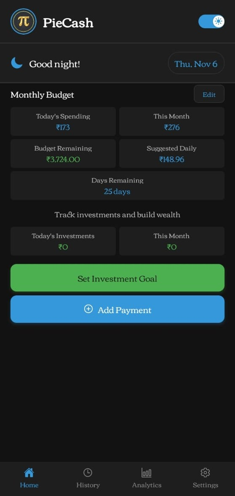
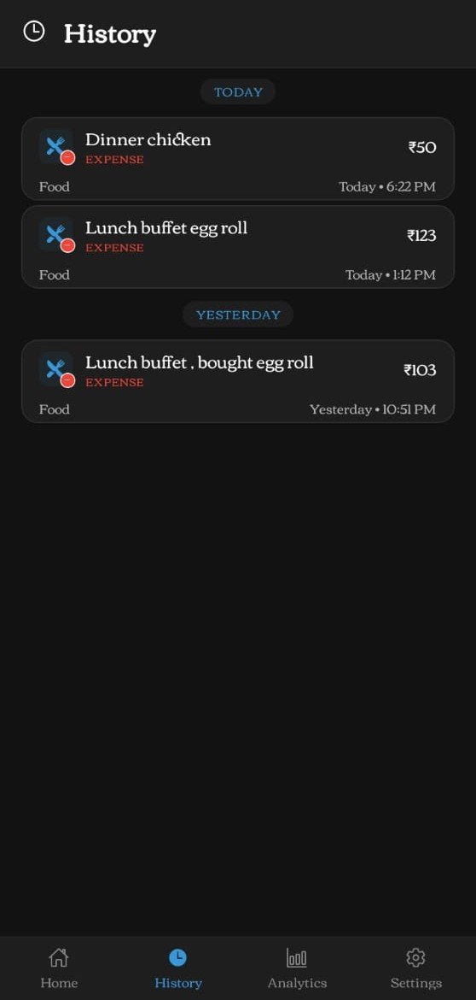
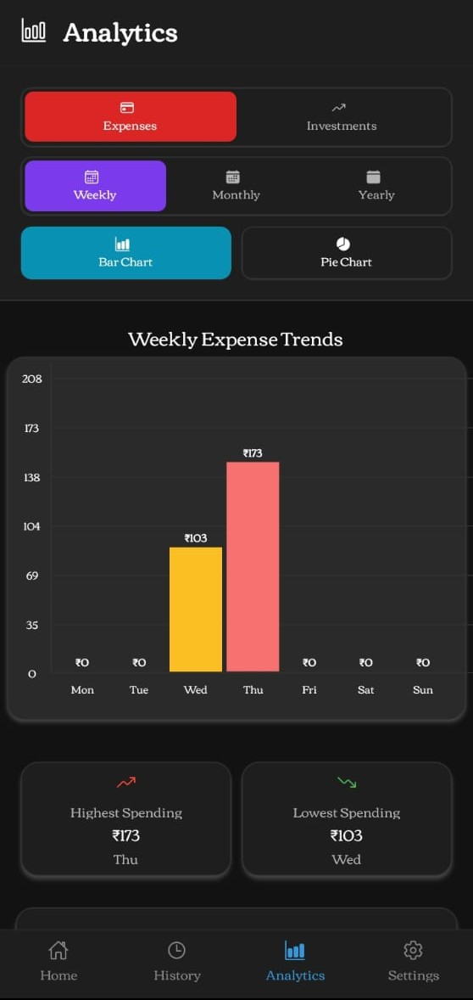
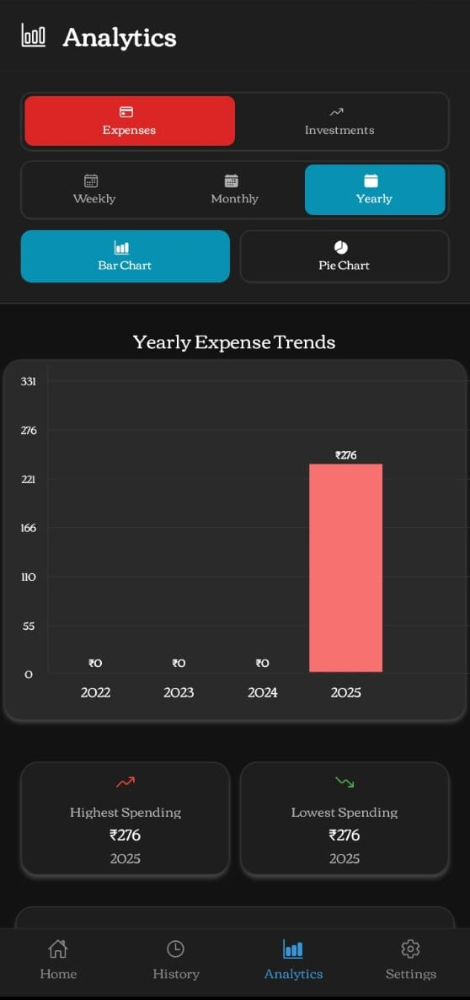
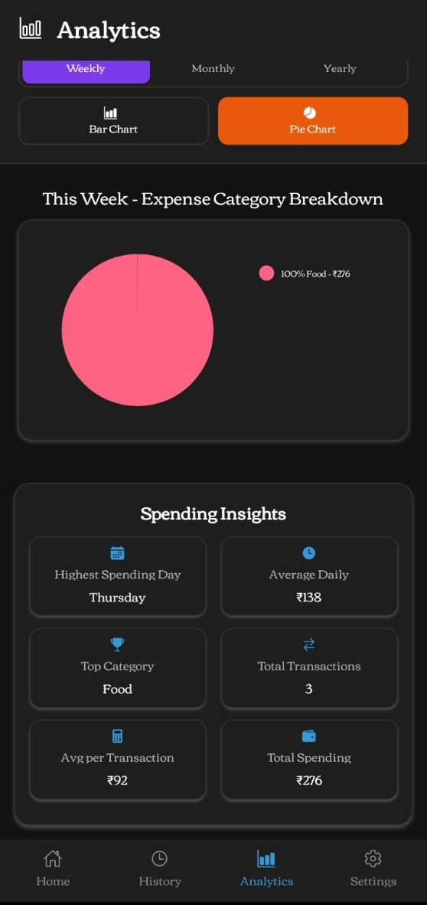
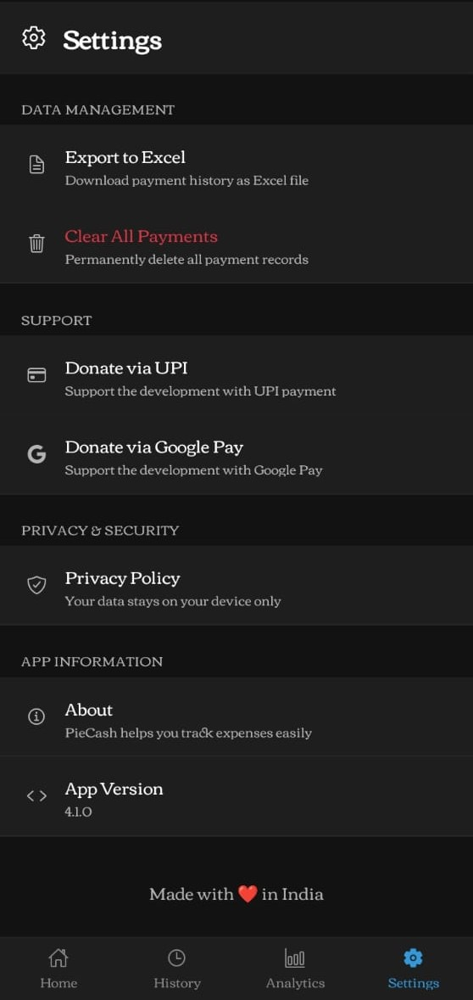
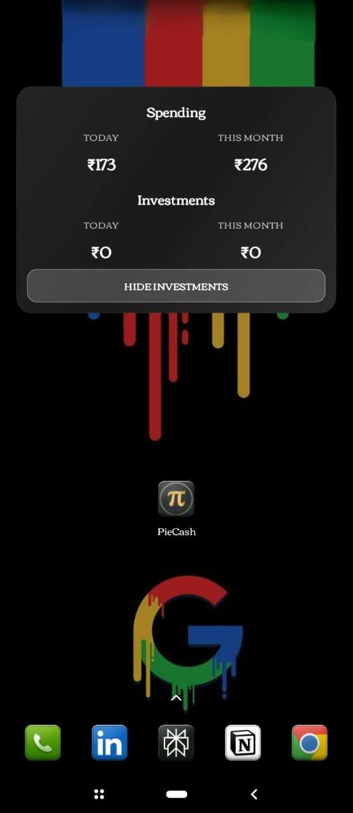

# PieCash

  

## Download

 **[Android APK](https://github.com/aRc-rAy/PieCash/releases/download/v4.1.0/PieCash-v4.1.0-arm32.apk)**

 **iOS - Coming Soon**

## Features

- Track spending, expense and investment
- History on payments
- Analytics screen with bar and pie charts
- Dark and light theme support
- All data stored locally on your phone for privacy

## Screenshots

### Home Screen

Track all your transactions at a glance

### History

View complete payment history with search and filters

### Analytics Tab 1

Bar charts showing spending trends over time

### Analytics Tab 2

Pie charts for category-wise expense breakdown

### Analytics Tab 3

Detailed insights and spending patterns

### Settings

Customize theme and app preferences

### Widget

Quick access from your home screen

